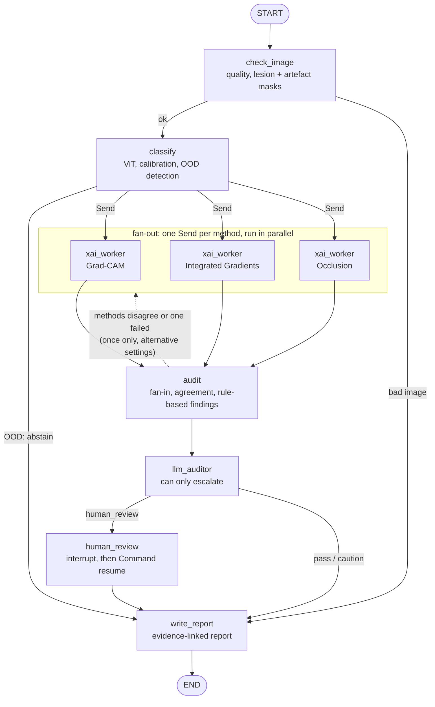

MedExplain is a LangGraph workflow that audits the predictions of a medical-image classifier. It does not diagnose. It decides whether a prediction and its explanation are reliable enough to present for human review.

A Vision Transformer (ViT-B/16), tuned with Optuna, classifies dermoscopic images from HAM10000 as melanoma or non-melanoma. Data are split by lesion to prevent leakage, and probabilities are calibrated on validation data only. Each image is first checked for quality and out-of-distribution behaviour. The graph then fans out three explanation methods in parallel, Grad-CAM, Integrated Gradients and occlusion, and merges their results.

Each explanation is tested rather than displayed. The tests ask whether the attribution falls inside the lesion or on acquisition artefacts, whether it explains the model better than a random map  and whether it survives small input perturbations. If the methods disagree, the analysis is repeated once with alternative settings.

Deterministic rules assign a status which is one of "pass", "pass with caution", "abstain", or, "human review". An LLM reviews the structured evidence but can only escalate a case. A key point we have tried to instill is that every claim it makes must cite an existing evidence ID. Escalated cases pause at a checkpointed interrupt until a reviewer accepts or overrides the decision. The architecture diagram of the project is found below:

  
